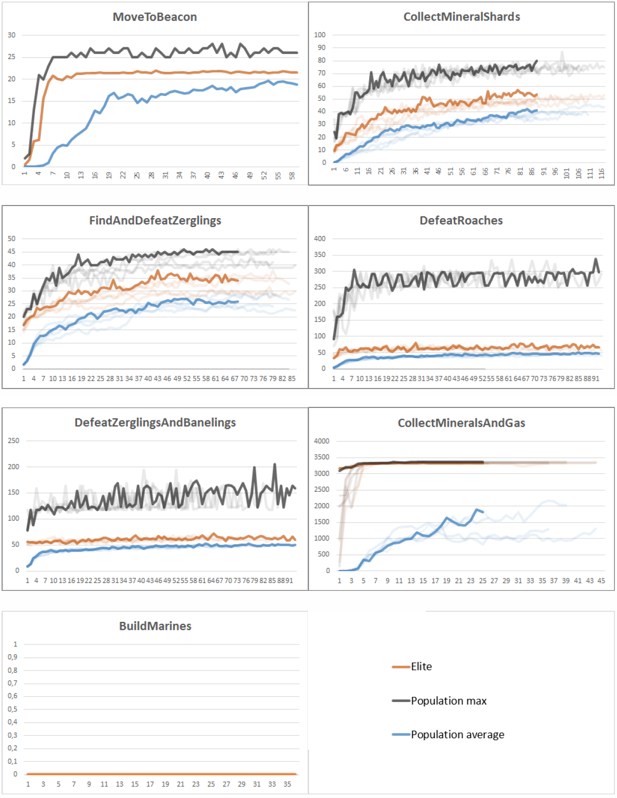

# Deep-Neuroevolution-In-SC2LE

This code was written as part of a master thesis.

Deep Neuroevolution concerns evolving deep neural networks using evolutionary algorithms.
The code contains a simple genetic algorithm (GA), that evolves a population of neural network models over the cource of generations.  
Each generation the worst models get truncated, while the best get to mutate, filling up the next generations population.
The neural network models have millions of parameters, so it would be infeasable to store those parameters as a parametervector.
For that reason a compresion method that was introduced by Uber Engineering (see paper below) was used to store these parameters in just hundreds of bytes. Each model is encoded as an array of seeds. To decompress the model these seeds are used to seed a pseudo random number generator, which then outputs the model parameters.

Uber Engineering's paper describing the GA and seed based compression method:  
https://arxiv.org/abs/1712.06567

SC2LE:
https://github.com/deepmind/pysc2  
Deep-Neuroevolution:
https://eng.uber.com/deep-neuroevolution/

## Results

Video of some of the agents's performances evolved using this code:  
https://www.youtube.com/watch?v=Bn1KmSrB7gY&t=43s  

# Start Guide
Both manager and workers need to run for the Genetic Algorithm to work.  
They don't have to be on the same machine, but they will need to be able to connect to the same  
broker/backend specified in celery_app.py  

It can be useful to run `python purge_tasks.py` to clean up the broker from leftover tasks after finishing an experiment and/or before running a new experiment

It is recommended to use Docker when running everything on one machine:  
	Crate custom network `$ docker network create network_name`  
	Create persistent volume `$ docker volume create deep_ne_volume`  
	Run Redis server container `$ docker run -itd --net network_name --name deep_ne_redis redis`  
	Get Redis server ip and set it in celery_app for broker and backend  
	Build a docker image from Dockerfile `$ docker build path_to_dockerfile --tag="deep_ne_SC2LE"`  
	Run container `$ docker run -itd --net network_name --name deep_ne_container --mount source=deep_ne_volume,target=/app/experiments deep_ne_SC2LE`  
	To connect to running container: `$ docker exec -i -t deep_ne_container /bin/bash`  
	Run manager and worker commands (listed below) in background. E.g.: `$ nohup python distributed_main.py &> nohup_manager.out&`  

## Manager  
To run the manager (main GA code) in default configuration run `python distributed_main.py`  
If you want to change the default configurations, run with flags (see distributed_main.py)  
example:  
`$ python distributed_main.py --map FindAndDefeatRoaches --use_minimap`  

## Worker  
To run the workers (for model evaluations) run:  
`$ celery -A evolution.tasks worker --loglevel=info --concurrency=4 -Ofair`  
	concurrency defines the number of workers. Start with 1/4 of CPU cores and increase if performance allows it  
	if not set: concurrency default is equal to CPU cores  

## Saving and loading experiments  
Set --save_to 'experiment_name' when running distributed_main.py to specify save location (within experiments folder)  
By default, save_to flag is "unnamed_experiment"  

To continue an experiment (saved within experiments folder) run distributed_main.py with following tags:  
--load_from experiment_name  
--save_to experiment_name (can be the same as load_from)  
--gen generation_number_to_continue  
Example:  
`$ python distributed_main.py --load_from experiment_name --save_to experiment_name --gen 50`  

## Manual model evaluation  
Example for running the best model from generation 30:  
`$ python local_model_evaluation.py --load_from experiment_name --top 1 --gen 30`  
